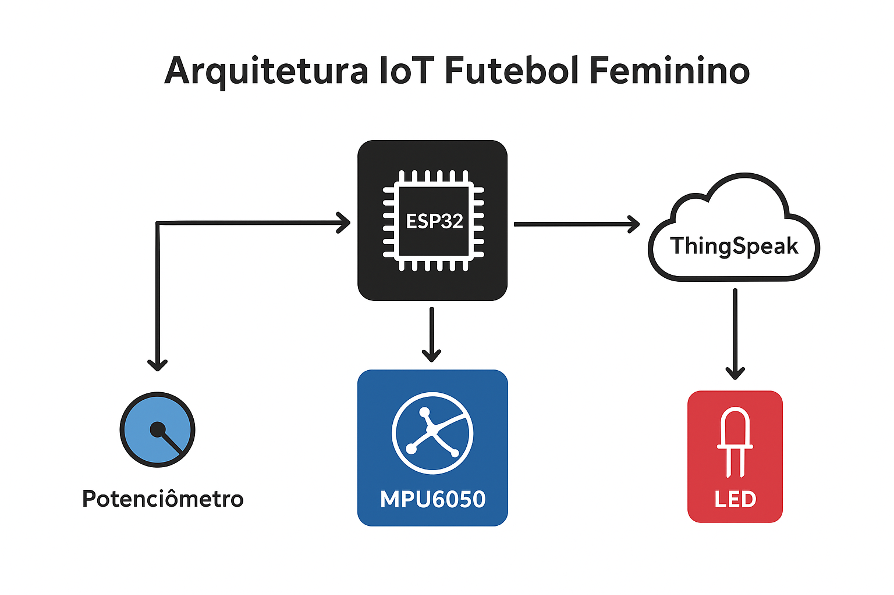

# IoT Kick Tracker ⚽

## 👥 Integrantes
- Julia Cabral Cruz
- Julia Silva Santos
- Luana Luo
- Sidyellen de Souza Sena

---

## 📖 Descrição do Projeto
O **IoT Kick Tracker** é um protótipo de baixo custo desenvolvido com **ESP32** e **sensor MPU6050** para monitorar a intensidade de chutes em treinos de futebol feminino.  
O sistema coleta dados de aceleração, giroscópio e velocidade simulada, enviando-os para a nuvem (ThingSpeak), onde podem ser analisados em tempo real.  

Esse projeto busca demonstrar como a **Internet das Coisas (IoT)** pode apoiar o **empoderamento feminino no esporte**, fornecendo métricas acessíveis para atletas e treinadoras.

---

## 🛠️ Arquitetura Proposta


### Explicação:
1. O **ESP32** coleta dados do sensor MPU6050 e de um potenciômetro.  
2. Processa localmente (detecta chutes potentes).  
3. Envia os dados via Wi-Fi para a nuvem (ThingSpeak).  
4. O ThingSpeak gera dashboards em tempo real.  
5. O feedback imediato é dado ao atleta por **LED**.

---

## 📦 Recursos Necessários
- ESP32
- Sensor MPU6050
- Potenciômetro
- Protoboard + jumpers
- Conta no [ThingSpeak](https://thingspeak.com/)

---

## 🚀 Instruções de Uso
1. Clone o repositório:
   ```bash
   git clone https://github.com/julia-ccruz/iot-kick-tracker.git
   ```

2. Abra o arquivo src/main.ino na Arduino IDE ou PlatformIO.

3. Instale as bibliotecas necessárias:

- WiFi.h

- HTTPClient.h

- Adafruit_MPU6050

- Adafruit_Sensor

4. Configure suas credenciais Wi-Fi e Write API Key do ThingSpeak no código.

5. Faça upload para o ESP32.

6. Acesse seu canal no ThingSpeak para visualizar os gráficos.

---

## 📊 Campos no ThingSpeak

- Field 1 → Velocidade simulada (km/h)

- Field 2 → Aceleração Z (m/s²)

- Field 3 → Nº de chutes (KickCount)

- Field 4 → Rotação Z (rad/s)

---

## 🕹️ Código .ino
```bash
/*
  Projeto: Monitor de Desempenho no Futebol Feminino
  Descrição:
    Este protótipo tem como objetivo monitorar o desempenho de jogadoras de futebol feminino 
    em treinamentos, medindo aceleração e rotação do corpo, intensidade de chutes/saltos e 
    velocidade simulada. Os dados são enviados para o ThingSpeak para análise e acompanhamento.
    
  Componentes utilizados:
    - ESP32 (placa de desenvolvimento)
    - Sensor MPU6050 (acelerômetro e giroscópio)
    - Potenciômetro (pino 34, usado para simular velocidade da corrida)
    - LED indicador (Pino GPIO2 do ESP32 para o LED Vermelho, alerta de chute forte)
    
  Funcionalidades principais:
    - Medição de aceleração e rotação
    - Simulação de velocidade da jogadora
    - Contador de chutes baseado em aceleração vertical
    - Feedback visual via LED
    - Envio de dados para ThingSpeak (aceleração, giroscópio, velocidade e chutes)
*/

#include <WiFi.h>
#include <HTTPClient.h>
#include <Adafruit_MPU6050.h>
#include <Adafruit_Sensor.h>
#include <Wire.h>

// Definições de pinos
#define POT_PIN 34           // Potenciômetro para simular velocidade
#define ALERT_LED_PIN 2      // LED indicador de chute forte

// Objeto do sensor MPU6050
Adafruit_MPU6050 mpu;

// Credenciais Wi-Fi e ThingSpeak
const char* ssid = "";          // Nome da rede Wi-Fi
const char* password = "";                 // Senha da rede Wi-Fi
const char* apiKey = "";   // Write API Key do ThingSpeak
const char* server = "http://api.thingspeak.com"; // Servidor ThingSpeak

// Variáveis do projeto
int kickCount = 0;                        // Contador de chutes
float kickThreshold = 15.0;               // Aceleração mínima para contar como chute (m/s²)

void setup() {
  Serial.begin(115200);

  // Configuração de pinos
  pinMode(POT_PIN, INPUT);
  pinMode(ALERT_LED_PIN, OUTPUT);
  digitalWrite(ALERT_LED_PIN, LOW);

  // Conexão Wi-Fi
  WiFi.begin(ssid, password);
  Serial.print("Conectando ao Wi-Fi");
  while (WiFi.status() != WL_CONNECTED) {
    delay(500);
    Serial.print(".");
  }
  Serial.println(" conectado!");

  // Inicialização do MPU6050
  if (!mpu.begin()) {
    Serial.println("Falha ao encontrar o MPU6050!");
    while (1) delay(10);
  }
  Serial.println("MPU6050 inicializado com sucesso!");

  // Configuração do sensor
  mpu.setAccelerometerRange(MPU6050_RANGE_8_G);
  mpu.setGyroRange(MPU6050_RANGE_500_DEG);
  mpu.setFilterBandwidth(MPU6050_BAND_5_HZ);
}

void loop() {
  if (WiFi.status() == WL_CONNECTED) {
    // Leitura do potenciômetro (simula velocidade da jogadora)
    int potValue = analogRead(POT_PIN);
    float speed = map(potValue, 0, 4095, 0, 180); // 0 a 180 km/h

    // Leitura do MPU6050
    sensors_event_t a, g, temp;
    mpu.getEvent(&a, &g, &temp);

    // Detecção de chute
    if (a.acceleration.z > kickThreshold) {
      kickCount++;
      digitalWrite(ALERT_LED_PIN, HIGH);  // Acende LED
      delay(200);
      digitalWrite(ALERT_LED_PIN, LOW);   // Apaga LED
    }

    // Impressão dos valores no Serial Monitor
    Serial.print("Aceleração X: "); Serial.print(a.acceleration.x);
    Serial.print(" | Y: "); Serial.print(a.acceleration.y);
    Serial.print(" | Z: "); Serial.print(a.acceleration.z); Serial.println(" m/s²");

    Serial.print("Giro X: "); Serial.print(g.gyro.x);
    Serial.print(" | Y: "); Serial.print(g.gyro.y);
    Serial.print(" | Z: "); Serial.print(g.gyro.z); Serial.println(" rad/s");

    Serial.print("Velocidade simulada: "); Serial.print(speed); Serial.println(" km/h");
    Serial.print("Chutes detectados: "); Serial.println(kickCount);

    // Envio dos dados para ThingSpeak
    HTTPClient http;
    String url = String(server) + "/update?api_key=" + apiKey + 
                 "&field1=" + String(speed) + 
                 "&field2=" + String(a.acceleration.z) + 
                 "&field3=" + String(kickCount) + 
                 "&field4=" + String(g.gyro.z);

    http.begin(url);
    int httpCode = http.GET();
    if (httpCode > 0) {
      Serial.println("Dados enviados ao ThingSpeak com sucesso!");
    } else {
      Serial.print("Erro ao enviar dados. Código HTTP: ");
      Serial.println(httpCode);
    }
    http.end();
  } else {
    Serial.println("Wi-Fi não conectado. Tentando reconectar...");
  }

  delay(2500); // Atualização a cada 2,5s
}


```
